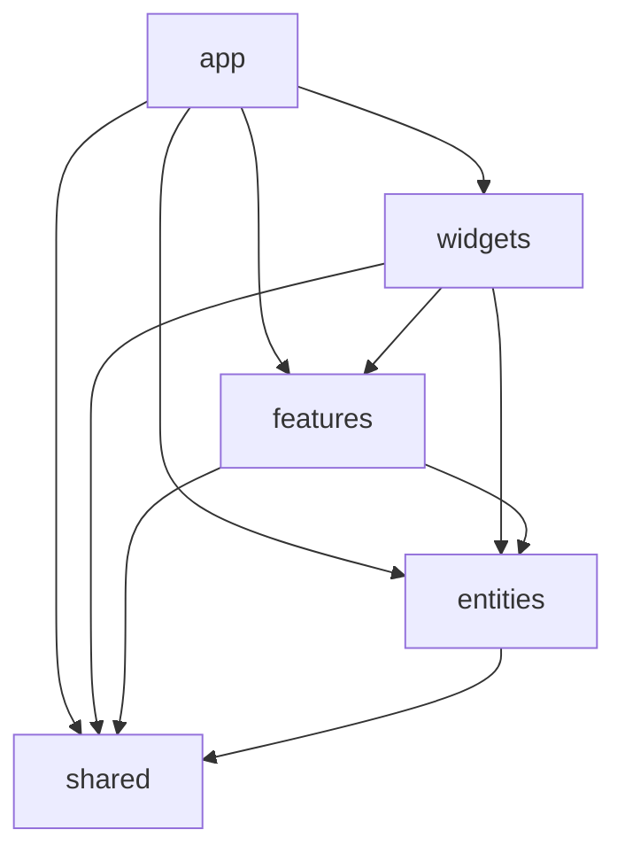

# 🦅 Eagle & Serpent (`eagle-n-snake`)

> **"Become who you are."**  
> — Friedrich Nietzsche, *Thus Spoke Zarathustra*

[](https://nextjs.org/)
[](https://react.dev/)
[](https://www.typescriptlang.org/)
[](https://tailwindcss.com/)
[](https://feature-sliced.design/)
[](https://developer.mozilla.org/en-US/docs/Web/API/Web_Audio_API)
[](LICENSE)

A digital philosophical artifact centered around Friedrich Nietzsche's eagle and serpent imagery from *Thus Spoke Zarathustra* (*Also sprach Zarathustra*, 1883).

Crafted at the intersection of **19th-century Nietzschean book engravings**, **extreme dark-metal linework & tattoo art**, **brutalist editorial typography**, and **contemporary high-performance frontend engineering**.

---

## 📖 Concept & Philosophy

In the Prologue to *Thus Spoke Zarathustra*, Zarathustra encounters two creatures who accompany him throughout his solitude:

> *"And behold! An eagle flew through the air in wide circles, and on it hung a serpent, not like a prey, but like a friend: for it kept itself coiled round the eagle's neck.*  
> *'They are my animals!' said Zarathustra, and rejoiced in his heart. 'The proudest animal under the sun, and the wisest animal under the sun—they have come out to reconnoiter.'"*

### The Philosophical Duality
- **The Eagle**: Represents celestial height, solitary pride, keen vision, courage, intellect, and the striving of the **Overman** (*Übermensch*) toward the heights.
- **The Serpent**: Represents terrestrial instinct, subterranean wisdom, bodily grounding, mystery, and the cyclical reality of the **Eternal Recurrence** (*Ewige Wiederkunft*).
- **Their Coiled Union**: The snake wrapped harmlessly around the eagle's throat is not a contest of predator and prey; it is an organic synthesis of instinct and intellect, earth and sky, ascent and descent.

### Visual & Atmospheric Language
- **Palette**: Deep void `#050505`, obsidian panels `#070707`, bone ivory `#dcd6cd` / `#e6e1da`, and charcoal hairlines `#1c1c1c`.
- **Typographic System**: Hybrid monospace precision (*Geist Mono*), editorial sans-serif (*Geist Sans*), classical epigraphic display (*Cinzel*), and historical book serif (*Cormorant Garamond*).
- **Aesthetic Elements**: Editorial corner registration marks (`+`), bracketed brutalist buttons (`[ ENTER ]`), bespoke distressed paper textures, and inverted ink graphics.

---

## ✨ Key Features & Interactive Systems

### 1. 🏛️ Dual-Pane Editorial Grid
- Balanced multi-column layout inspired by traditional book plates and modern brutalist editorial boards.
- Fluid responsiveness seamlessly transitioning between dense desktop side-by-side modules and layered mobile compositions.
- Synchronized card heights and hairline crosshair dividers.

### 2. 🧭 The Three Philosophical Paths
- Interactive pathway navigation tabs cycling through core Nietzschean aphorisms:
  - **`01` // OVERCOME YOURSELF** (*Zarathustra's Prologue § 4* — Man as a rope over an abyss)
  - **`02` // CREATE YOUR VALUES** (*On the Way of the Creator* — Burning in one's own flame)
  - **`03` // ETERNAL RETURN** (*The Gay Science § 341* — The eternal hourglass of existence)

### 3. 🔮 Occult Sigil Taxonomy & Explorer
- An interactive catalog showcasing 8 symbolic emblems (*Aquila Solis*, *Ouroboros Axis*, *Spire of Solitude*, *Thorn of Creation*, *Coiled Embrace*, *Black Sun Eclipse*, *Serpent's Instinct*, *Feathered Crest*).
- Interactive card selection revealing deep philosophical annotations and iconography.
- Micro-parallax perspective shifts upon hover.

### 4. 🔊 Procedural Web Audio Ambient Synthesizer
- Zero external audio files or bandwidth overhead. Synthesizes an atmospheric dark drone entirely in real-time via the **Web Audio API**:
  - **55 Hz** fundamental sine sub-oscillator ($A_1$).
  - **55.4 Hz** slightly detuned sawtooth oscillator generating slow binaural beating.
  - **110 Hz** harmonic overtone sine wave ($A_2$).
  - **140 Hz** resonant lowpass biquad filter with exponential gain ramping for smooth fading.

### 5. ⚡ Smooth Pointer Parallax (Zero Re-render)
- High-frequency pointer tracking decoupled from the React lifecycle via `requestAnimationFrame` lerping.
- Coordinates written directly to CSS custom properties (`--mouse-x`, `--mouse-y`) on targeted DOM containers.
- Full respect for accessibility via `prefers-reduced-motion`.

### 6. 📜 Archival Excerpt Reader Modal
- Native HTML5 `<dialog>` component with light-dismiss backdrop, ESC key handling, and focus management.
- Extended archival excerpts from *Thus Spoke Zarathustra*.

### 7. 🌐 Comprehensive SEO & Social Sharing Architecture
- Complete metadata suite with OpenGraph, Twitter Cards, Apple Touch Icons, and dynamic Web App Manifest.
- Structured **Schema.org** JSON-LD graph defining `WebSite` and `CreativeWork` entities.
- Automated validation script verifying asset integrity.

---

## 🏗️ Project Architecture (Feature-Sliced Design)

The repository strictly follows **[Feature-Sliced Design (FSD)](https://feature-sliced.design/)**, ensuring high maintainability, low coupling, and predictable layer boundaries:

```
src/
├── app/                  # Next.js App Router layer (routing, layout, metadata, styles)
│   ├── favicon.ico       # Multi-resolution favicon icon
│   ├── globals.css       # Tailwind CSS v4 directives, custom ink filters, theme tokens
│   ├── layout.tsx        # Root HTML shell, fonts, JSON-LD Schema, viewport, metadata
│   ├── manifest.ts       # PWA webmanifest configuration
│   ├── page.tsx          # Main entry assembly page
│   ├── robots.ts         # Search engine crawler policies
│   └── sitemap.ts        # XML sitemap generator
│
├── widgets/              # Autonomous, self-contained composite UI sections
│   ├── author-signature/ # Colophon and author profile link
│   ├── hero-section/     # Primary title, creature artwork, and path navigator
│   ├── highest-will-section/ # Solitary peak artwork & poetic manifesto
│   ├── sigil-explorer/   # 8-part occult taxonomy grid & inspector
│   ├── site-footer/      # Ornamental divider and Zarathustra conclusion
│   ├── site-header/      # Persistent sticky header with controls
│   └── zarathustra-section/ # Overman quote plate & vertical creature artwork
│
├── features/             # User interaction & behavioral slices
│   ├── ambient-sound/    # Audio drone toggle button & state
│   ├── path-navigation/  # Three-stage aphorism tab selector
│   └── reading-modal/    # Modal reader for Zarathustra discourses
│
├── entities/             # Business domain models & content collections
│   ├── philosophy/       # Path quotes, sources, and Zarathustra readings
│   └── sigil/            # Sigil data model, taxonomy aspects, and descriptions
│
└── shared/               # Reusable primitives, utilities, and foundation tokens
    ├── config/           # Central design tokens (palette, typography)
    ├── lib/              # Custom hooks (Web Audio drone, mouse parallax, motion)
    └── ui/               # Base UI atoms (BracketButton, CornerCross, GeometricAxis, TextureOverlay)
```

### Layer Dependency Rules


---

## 🛠️ Technology Stack

| Domain | Technology | Description |
| :--- | :--- | :--- |
| **Framework** | [Next.js 16.3.0](https://nextjs.org/) | App Router, React Server Components, TypeScript compilation |
| **Library** | [React 19.2.8](https://react.dev/) | Core UI rendering engine |
| **Language** | [TypeScript 5](https://www.typescriptlang.org/) | Strict type checking & interfaces across all slices |
| **Styling** | [Tailwind CSS v4](https://tailwindcss.com/) | Modern `@tailwindcss/postcss` engine with theme tokens |
| **Typography** | `next/font/google` | Cinzel, Cormorant Garamond, Geist Sans, Geist Mono |
| **Audio** | Web Audio API | Pure client-side multi-oscillator binaural drone generator |
| **Icons & Favicons** | Sips & Custom Scripting | Multi-layer ICO, SVG vector icons, PWA touch icons |
| **Package Manager**| [pnpm 10.28.2](https://pnpm.io/) | Fast, disk-space efficient package management |
| **Code Quality** | ESLint 9 + Next.js config | Automated linting and style enforcement |

---

## 🚀 Getting Started

### Prerequisites
- **Node.js**: `v20.x` or higher
- **pnpm**: `v10.x` (or `corepack enable pnpm`)

### Installation & Local Development

1. **Clone the repository**:
   ```bash
   git clone https://github.com/IgoHz/eagle-n-snake.git
   cd eagle-n-snake
   ```

2. **Install dependencies**:
   ```bash
   pnpm install
   ```

3. **Start the local development server**:
   ```bash
   pnpm dev
   ```
   Open [http://localhost:3000](http://localhost:3000) in your browser to view the artifact.

4. **Production Build**:
   ```bash
   pnpm build
   pnpm start
   ```

5. **Linting**:
   ```bash
   pnpm lint
   ```

---

## ⚙️ Maintenance & Asset Automation Scripts

The repository includes dedicated Node.js maintenance scripts in `scripts/`:

| Script | Command | Purpose |
| :--- | :--- | :--- |
| **SEO Asset Verification** | `node scripts/verify-seo.mjs` | Verifies existence and byte sizes of all required favicons, OpenGraph cards, sitemaps, and manifests. |
| **Favicon Synchronization** | `node scripts/sync-favicon-assets.mjs` | Extracts multi-resolution PNGs (16x16, 32x32, 180x180, 192x192, 512x512) and SVGs directly from `favicon.ico`. |
| **Asset Generation** | `node scripts/generate-assets.mjs` | Generates procedural graphical components and masks. |

---

## 🧭 Design System Tokens

Located at `src/shared/config/design-tokens.ts` and configured in `src/app/globals.css`:

```typescript
export const DESIGN_TOKENS = {
  colors: {
    background: "#050505", // The primordial void
    panel: "#080808",      // Subtle card elevations
    borderSubtle: "#1c1c1c", // Fine hairline separators
    borderStrong: "#2c2c2c", // Accented borders
    textPrimary: "#dcd6cd",  // Bone ivory text
    textMuted: "#7a7772",    // Aged parchment secondary text
    textFaint: "#4a4844",    // Low-contrast editorial labels
    accentBone: "#e6e1da",   // Highlighted active states
  },
  typography: {
    headline: "var(--font-sans)",
    mono: "var(--font-geist-mono)",
    serif: "var(--font-cormorant)",
    display: "var(--font-cinzel)",
  },
} as const;
```

---

## 🔮 Roadmap & Explorations

- [ ] **Bilingual Toggle**: Seamless switching between Walter Kaufmann's English translation and Friedrich Nietzsche's original German text (*Also sprach Zarathustra*).
- [ ] **Extended Discourses**: Further archival chapters (*On the Three Metamorphoses*, *On Reading and Writing*, *The Convalescent*).

---

## 👤 Author & Colophon

- **Concept, Design & Architecture**: [Ihor Tkachenko](https://github.com/IgoHz)
- **GitHub**: [@IgoHz](https://github.com/IgoHz)
- **Repository**: [IgoHz/eagle-n-snake](https://github.com/IgoHz/eagle-n-snake)

---

## 📄 License

This project is open-source and licensed under the [MIT License](LICENSE).